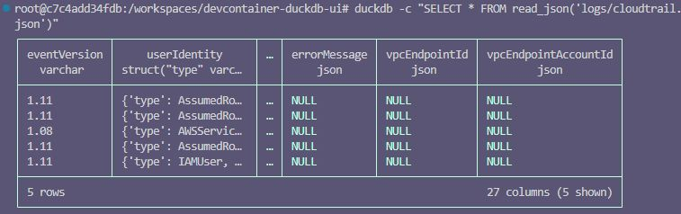

# devcontainer-duckdb-ui

*Read this in other languages:* [](./README.ja.md) [](./README.md)


A development container setup for DuckDB UI with HTTPS support and sample JSON log analysis.


## Features

- 🚀 Ready-to-use DuckDB UI in a Dev Container
- 🔒 HTTPS support (ports 8080/8443)
- 📊 Sample JSON log files included (CloudTrail, Falco)
- 🐳 Docker Compose based setup
- 💾 Persistent data volume

## Prerequisites

- [Visual Studio Code](https://code.visualstudio.com/)
- [Docker Desktop](https://www.docker.com/products/docker-desktop/)
- [Dev Containers extension](https://marketplace.visualstudio.com/items?itemName=ms-vscode-remote.remote-containers)

## Getting Started

1. Clone this repository:
   ```bash
   git clone https://github.com/ishiharatma/devcontainer-duckdb-ui.git
   cd devcontainer-duckdb-ui
   ```

2. Open in VS Code:
   ```bash
   code .
   ```

3. When prompted, click "Reopen in Container" (or press F1 and select "Dev Containers: Reopen in Container")

4. Wait for the container to build and start

5. Access DuckDB UI:
   - HTTP: http://localhost:8080/
   - HTTPS: https://localhost:8443/

## Sample Usage

The repository includes sample JSON log files in the `logs/` directory. 

### Using DuckDB CLI

You can query JSON files directly from the command line:

```bash
duckdb -c "SELECT * FROM read_json('logs/cloudtrail.json')"
```



### Using DuckDB UI

You can create tables from these files:

```sql
CREATE TABLE cloudtrail AS SELECT * FROM read_json('/workspaces/duckdb-ui/logs/cloudtrail.json');
CREATE TABLE cloudtrail_insight AS SELECT * FROM read_json('/workspaces/duckdb-ui/logs/cloudtrail_insight.json');
CREATE TABLE falco AS SELECT * FROM read_json('/workspaces/duckdb-ui/logs/falco.json');
```

Then query the data:

```sql
SELECT * FROM cloudtrail LIMIT 10;
```

## Project Structure

```
.
├── .devcontainer/
│   ├── devcontainer.json    # Dev Container configuration
│   └── docker-compose.yaml  # Docker Compose setup
├── logs/                    # Sample JSON log files
│   ├── cloudtrail.json
│   ├── cloudtrail_insight.json
│   └── falco.json
├── images/                  # Screenshots
└── README.md
```

## DuckDB UI Docker Image

This project uses the [kudaw/duckdb-ui](https://hub.docker.com/r/kudaw/duckdb-ui) Docker image (version 1.3.2).

## Data Persistence

Database files are stored in the `duckdb_data` Docker volume and persist between container restarts.

## References

- [DuckDB](https://duckdb.org/) - Official DuckDB website
- [DuckDB Tutorial For Beginners](https://motherduck.com/blog/duckdb-tutorial-for-beginners/) - Getting started with DuckDB

## Contributing

Contributions are welcome! Please feel free to submit a Pull Request.

## License

This project is open source and available under the [MIT License](LICENSE).